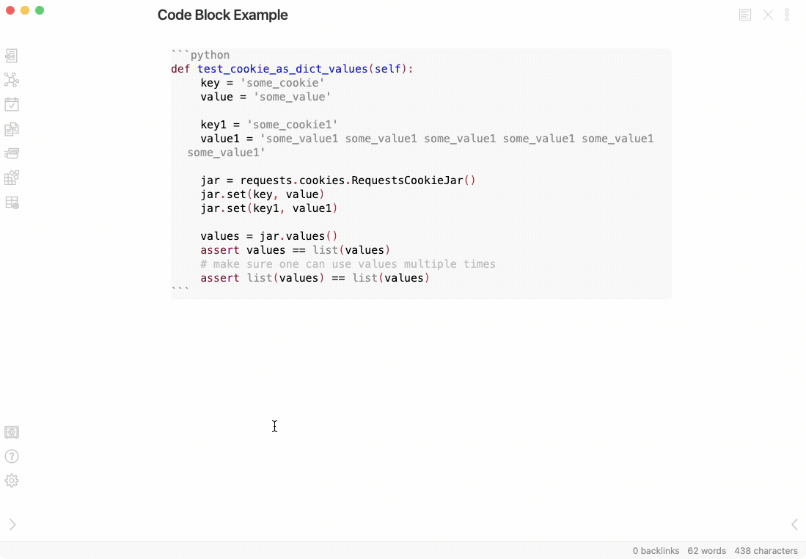
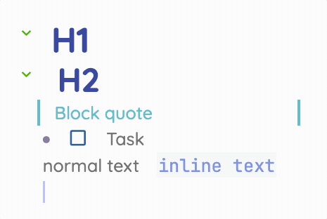
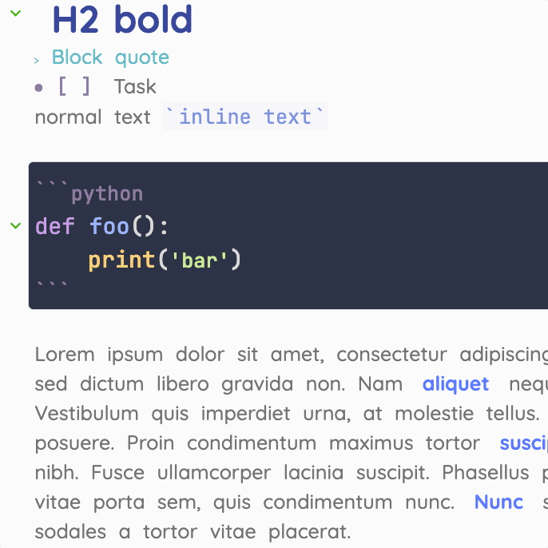

# Obsidian CodeMirror Options

This plugin adds configurable options to customize the behavior of CodeMirror.

## Installation

### Manual Installation
To manually install
 1. download the latest `zip`from the [latest Github Release](https://github.com/nothingislost/obsidian-codemirror-options/releases/latest)
 1. unzip the contents into the `.plugins/obsidian-codemirror-options` subdirectory of your vault.
 1. reload obsidian
 1. go into settings > third party plugins and activate obsidian-codemirror-options

For details see [the forums](https://forum.obsidian.md/t/plugins-mini-faq/7737).

## Features

### Syntax Highlighting



When enabled, this plugin will apply a consistent syntax highlighting theme to code blocks in both edit and preview modes.

By default, the plugin applies the theme "Material: Palenight" to both light and dark modes.

If you'd like to customize the syntax highlighting theme, install Style Settings and explore the CodeMirror Options section within the Style Settings Plugin Options.

This plugin currently includes 4 theme options out of the box:

- Solarized Light
- Material Palenight
- Dracula
- Custom

When using the custom theme, you can customize any of the available syntax highlighting colors. You can also use the custom theme option to import your own themes using the Style Settings import function.

Here's an example of importing the Dracula theme for use in dark mode only:

```json
{
"CodeMirror Options@@cm-background@@dark": "#282a36",
"CodeMirror Options@@cm-foreground@@dark": "#f8f8f2",
"CodeMirror Options@@cm-comment@@dark": "#6272a4",
"CodeMirror Options@@cm-string@@dark": "#f1fa8c",
"CodeMirror Options@@cm-string-2@@dark": "#f1fa8c",
"CodeMirror Options@@cm-number@@dark": "#bd93f9",
"CodeMirror Options@@cm-variable@@dark": "#50fa7b",
"CodeMirror Options@@cm-variable-2@@dark": "#ffffff",
"CodeMirror Options@@cm-def@@dark": "#50fa7b",
"CodeMirror Options@@cm-operator@@dark": "#ff79c6",
"CodeMirror Options@@cm-keyword@@dark": "#ff79c6",
"CodeMirror Options@@cm-atom@@dark": "#bd93f9",
"CodeMirror Options@@cm-meta@@dark": "#f8f8f2",
"CodeMirror Options@@cm-tag@@dark": "#ff79c6",
"CodeMirror Options@@cm-attribute@@dark": "#50fa7b",
"CodeMirror Options@@cm-qualifier@@dark": "#50fa7b",
"CodeMirror Options@@cm-property@@dark": "#66d9ef",
"CodeMirror Options@@cm-builtin@@dark": "#50fa7b",
"CodeMirror Options@@cm-variable-3@@dark": "#ffb86c",
"CodeMirror Options@@cm-type@@dark": "#ffb86c",
"CodeMirror Options@@cm-activeline-background@@dark": "#414458",
"CodeMirror Options@@cm-matchingbracket@@dark": "#ffffff"
}
```

Similarly, you can import a theme for use in light mode by using @@light:

```json
{
"CodeMirror Options@@cm-background@@light": "#282a36",
"CodeMirror Options@@cm-foreground@@light": "#f8f8f2",
"CodeMirror Options@@cm-comment@@light": "#6272a4",
"CodeMirror Options@@cm-string@@light": "#f1fa8c",
"CodeMirror Options@@cm-string-2@@light": "#f1fa8c",
"CodeMirror Options@@cm-number@@light": "#bd93f9",
"CodeMirror Options@@cm-variable@@light": "#50fa7b",
"CodeMirror Options@@cm-variable-2@@light": "#ffffff",
"CodeMirror Options@@cm-def@@light": "#50fa7b",
"CodeMirror Options@@cm-operator@@light": "#ff79c6",
"CodeMirror Options@@cm-keyword@@light": "#ff79c6",
"CodeMirror Options@@cm-atom@@light": "#bd93f9",
"CodeMirror Options@@cm-meta@@light": "#f8f8f2",
"CodeMirror Options@@cm-tag@@light": "#ff79c6",
"CodeMirror Options@@cm-attribute@@light": "#50fa7b",
"CodeMirror Options@@cm-qualifier@@light": "#50fa7b",
"CodeMirror Options@@cm-property@@light": "#66d9ef",
"CodeMirror Options@@cm-builtin@@light": "#50fa7b",
"CodeMirror Options@@cm-variable-3@@light": "#ffb86c",
"CodeMirror Options@@cm-type@@light": "#ffb86c",
"CodeMirror Options@@cm-activeline-background@@light": "#414458",
"CodeMirror Options@@cm-matchingbracket@@light": "#ffffff"
}
```

The CSS properties match closely to the standard properties used by CodeMirror. You can find more theme colors here https://codemirror.net/theme/ and adapt them to this import format.

## Settings

### Dynamic Cursor Sizing


When enabled, the cursor height will be determined by the max height of the entire line. When disabled, the cursor's height is based on the height of the adjacent reference character.

### Retain Active Line on Selection



When enabled, text selection will not remove the .active-line class on the current line. When disabled text selection on the active line will remove the .active-line class.

### Mark Selected Text with a CSS class



When enabled, selected text will be marked with the CSS class .CodeMirror-selectedtext. This replaces the default CodeMirror selection functionality which mimics a selection by painting a background layer behind the text. This new option grants more styling flexibility and avoids issues when selecting items that have defined backgrounds.

### Use CodeMirror for syntax highlighting in preview mode

This setting creates consistent highlighting between edit and preview by using CodeMirror to highlight in both modes. **Note**: This setting requires the "Editor Syntax Highlight" plugin to function.

### Fallback: Unify the default prism.js code block styling

This setting is a fallback option if you do not want to inject CM into preview mode. It will try and unify the prism.js colors to match the CodeMirror theme as close as possible.

## Known Issues

- This plugin leverages the CM5 API directly which is a deprecated option. Obsidian will be moving to CM6 soon and this plugin will break. I'm not sure yet if I'll be able to make these same tweaks on CM6.

## Changelog

### 0.1.1

- Bug fixes to the line number and copy button handling
- Add highlighting support for `js` `html` and `json`

### 0.1.0

- Add an option to show line numbers in preview mode
- Add a copy button to code blocks in preview mode
- Fix the default font size for code blocks to 16px. This can be overridden using Style Settings
- In preview mode, wrap code blocks in a `<code>` element to better mimic the original prism.js DOM structure.
  - The structure is now `<div><pre><code></code></pre></div>`
  - This change should hopefully be transparent for most use csses

### 0.0.8

- This is the stable(ish) release of the features introduced in the 0.0.7 pre-release.
- This release adds two HyperMD features
  - Hide Markdown Syntax
  - Click Handling for Checkboxes
- Adds syntax highlighting support for plugins like Obisdian Plaintext & CodeView

### 0.0.7 (pre-release)

- This release adds two HyperMD features
  1. Hide Markdown Syntax
  2. Click Handling for Checkboxes

### 0.0.6

- Changed the method used for marking multiple lines with .active-line which should resolve a few bugs
- Previously .active-line would start behaving strangely after having 8 lines selected
- The previous method was also not effecient and applied the .active-lines class too often
- Previously, the "Style Active Selection" and "Mark Active Lines" settings were too intermingled. You can now set each feature on or off without impacting each other.

### 0.0.5

- Fixed a bug in the "Style Active Selection" option which was causing an undefined variable error on file load

### 0.0.4

- Updated "Retain Active Line on Selection" to support multi-cursor selection

### 0.0.3

- Updated "Retain Active Line on Selection" to support multi-line selection

### 0.0.2

- Code cleanup
- Added Syntax Highlighting options

### 0.0.1

- Initial release
  - Enabled toggles for:
    - Dynamic Cursor Sizing
    - Retain Active Line on Selection
    - Mark Selected Text with a CSS class
